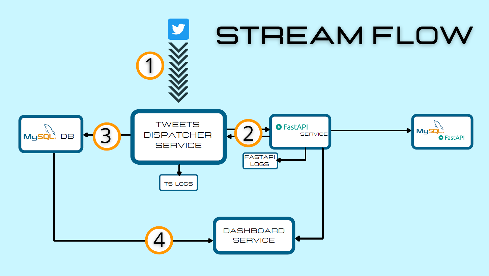
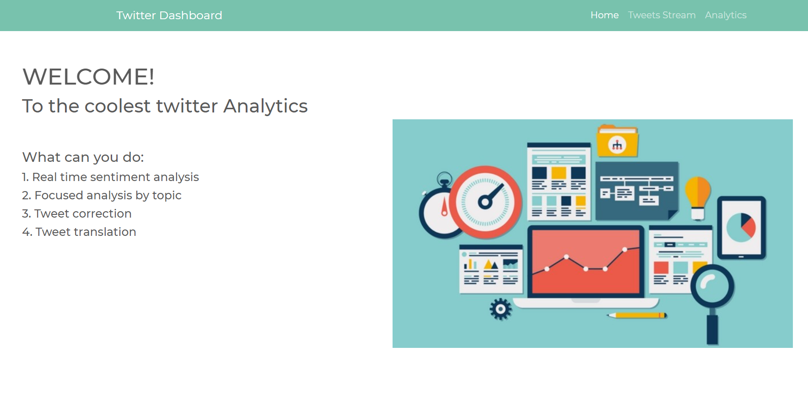

# Twitter Sentiment Analysis Service
**@ Author:** Matteo Broglio
**@Dashboard :** **[--> link to the dashboard <--](http://ec2-34-230-76-89.compute-1.amazonaws.com:8050/ )**

### ABSTRACT
The goal of this project is to provide a ready-to-use service for twitter sentiment analysis.
In particular, this service solves these tasks:
1. **Tweets collection:** Through Tweepy( python connectivity library to Twitter API) we can collect and save tweets into a MySQL database in order to create a dataset for analysis or machine learning model training.
2. **Real time Twitter stream analysis:** We can monitor the sentiment of a specific topic while we collect data (tweets) through a dashboard developed in Dash( python framework for dashboards)
2. **Batch analysis of tweets:** We can do further and more complex analysis on the collected data through a specific dashboard( developed in Dash)
3. **Single tweet analysis:** We can analyze and elaborate a single tweet. In particular:
    - Get a correct version of the tweet.
    - Get a translated version of the tweet.
    - Get a polarity and subjectivity of the tweet.

 
In the file **Presentation.pdf**  you can find a short overview of the project.

### Technical aspects
The service is developed with a microservice architecture and it is made up by three main components:
1. **Tweets dispatcher:** This component is in charge to manage the stream of tweets and to store them in the database.
2. **API:** This is the core component of the service. It is developed in a rest API architecture and is rresponsible for all the functionality used in the dashboard( prediction, correction, translation).
3. **Dashboard:** This is the front-end component of the service. It allows user to interact with the data. Here, users can:
	- Monitor the stream of tweets.
	- Analyze the data.
	- Manipulate the tweets( translation, correction, prediction).
	
	
### Tweets Dispatcher Service
Here, you can find an overview of the flow:

1. Through the Twitter API, data flows to the service and stored in a queue. 
2. For each new tweet in the queue, the service open a new thread an send it to the API through a http request.
3. After the response of the API service, the new information is stored in a MySQL database.
4. This flow can be monitored by a dashboard, which analize the operations in real-time.

### API SERVICE
The API service is the core component of this project. Services implemented:
- **"/getPredictedTweet":** For a given tweet, it returns the sentiment, polarity and subjectivity of a tweet.
- **"/getCleanTweet":** For a given tweet, it returns a copy of the tweet cleaned by special characters.
- **"/getCorrectTweet":** For a given tweet, it returns a correct version(i.e. without ortographical errors) ot the tweet.
- **"/getTranslatedTweet":** For a given tweet, it returns its translation in the italian language.
- **"/getTweetsByTopic":** For a given topic and range of dates, it returns the list of tweets collected in the database.

### DASHBOARD SERVICE
The dashboard is the analytics tool of the service. Structure:

- **Homepage:** This is the homepage of the service. Here you can find a brief introduction on the dashboard.
- **Tweets Stream:** This page is dedicated to the monitoring of the tweets' stream.
- **Analytics:** This page is dedicated to the batch analysis of the tweets. In particular:
    - **Topic:** Here you can alnalyze data for a given topic in a specific range of dates.
    - **Tweet:** Here you can get useful information about a specific tweet.